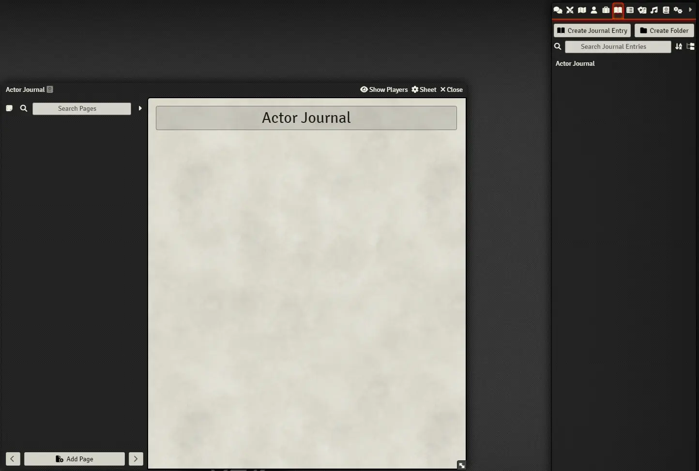
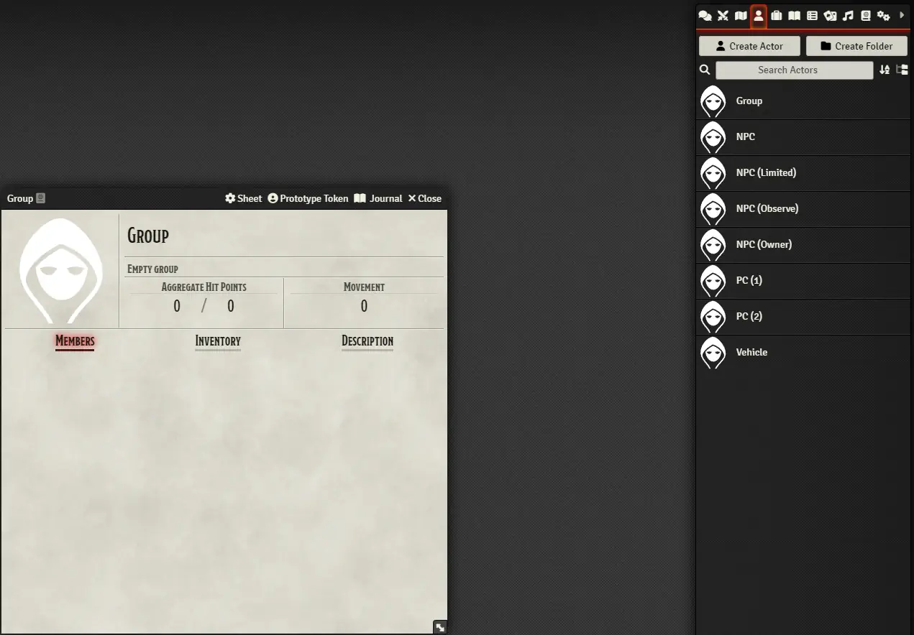
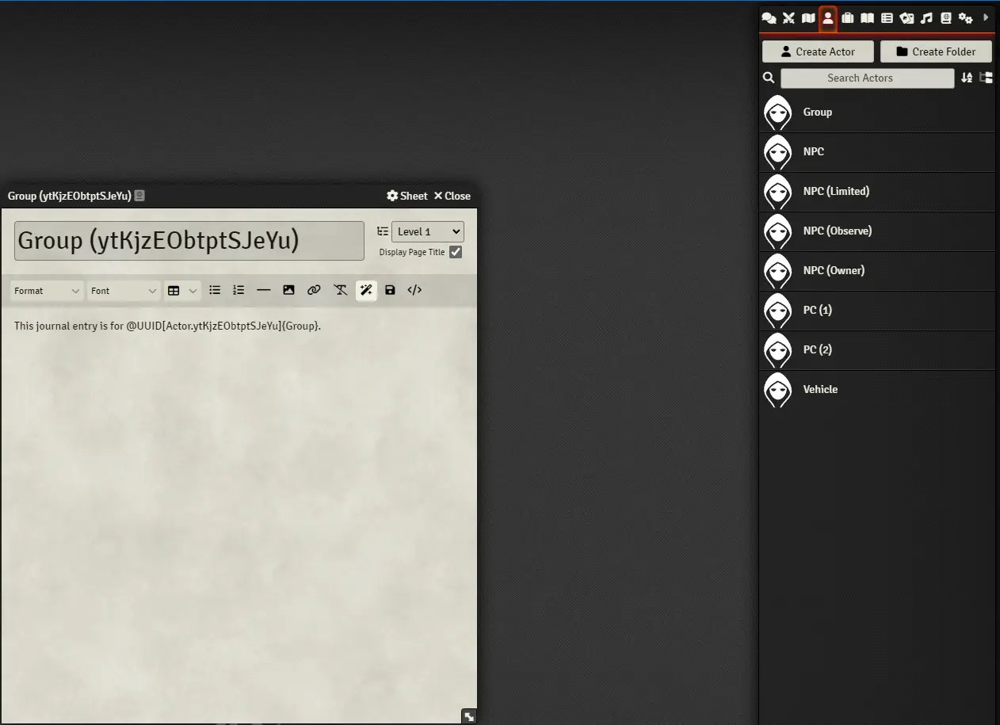
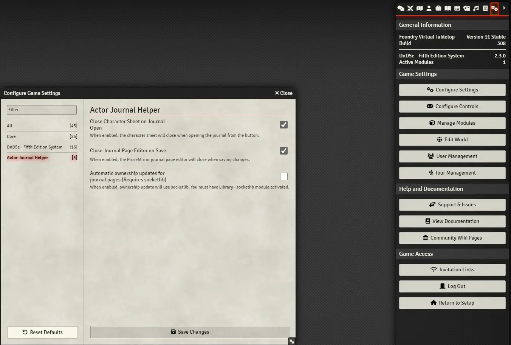

# Actor Journal Helper

**Foundry VTT Compatibility**: Version 0.11.x

## Manifest URL
https://raw.githubusercontent.com/puddleimages/actor-journal-helper/main/module.json

## Dependencies
While it is not a dependency for the module, installing and enabling **Socketlib** before enabling the optional 'Automatic Ownership Updates' setting is highly recommended.

It is also highly recommended that you use **Ownership Viewer** in conjunction with this module because of the convenience it adds to viewing and adjusting ownership levels.
 
## Description

This module streamlines the process of creating and managing a shared journal page for each actor by providing a button in the character sheet header that pulls up the editor window for the associated journal page after creating it (if it didn't already exist) and adding a link to the page's contents that can be used later to access the character sheet of the actor associated with it. Optionally, this module conveniently closes windows as the user navigates to the editor and commits their changes to the journal page, while allowing users to automatically gain ownership of a journal page associated to any actor that they have at least "limited" ownerhip of as long as a GM is logged in.

## Installation

1. In Foundry VTT, navigate to the "Add-On Modules" tab in the Configuration and Setup menu.
2. Click the "Install Module" button.
3. Paste the following URL into the "Manifest URL" field: `https://raw.githubusercontent.com/puddleimages/actor-journal-helper/main/module.json`
4. Click "Install" and wait for Foundry VTT to automatically install the module.

## Usage

1. Activate the module and, optionally, activate library - socketlib
2. Configure the optional setting to your liking.
3. Open an actor's character sheet (limited ownership or higher required).
4. Look for the button labeled "Journal" in the sheet's header.
5. Click the button to open an editor for an existing or newly created journal page associated with the actor.
6. Enjoy the simplified navigation to the editor of the associated journal page
7. Enjoy the automatically generated link to the character sheet of an actor from their corresponding journal page.
7. Optionally, with automatic ownership updates, maintaining control over these journal pages is now simplified or even hassle-free.

**Usage Notes**

When using this module, it is recommended that the GM grants users "limited" ownership of actors (being careful of what they leave in the biography section) as they encounter those actors. This allows users to take advantage of the "Journal" button and add content to the generated journal pages collaboratively (or independantly if they are the only user with access to the page). Keep it in mind that, pages which are manually added to the "Actor Journal" won't be linked to the "Journal" button of any actor's character sheet.

Users can access the "Journal" button via the actor's character sheet only if they have "limited" or higher ownership of an actor. Users can double-click these actors' tokens on the canvas to gain access to the character sheet and the "Journal" button, providing them with a quick way to edit (or view) their notes in the ProseMirror editor window. The actor's character sheet can also be accessed at any time via the "Actor" tab if the token isn't available. All of the pages can also be accessed via the "Actor Journal" in the "Journal" tab.

## Features

- **Actor Journal**: Automatically creates a "Actor Journal" journal entry for storing journal pages associated with actors.
- **Page Generation**: Adds a "Journal" button to the header of character sheets for generating a journal page associated with the actor and pulling up the page's editor window.
- **Link Generation**: When an actor's "Journal" button is first clicked and the their associated page is generated, a link to the actor is added to the journal page.
- **Limited Ownership**: most of the modules features are only accessible when a user has "limited" or higher ownership of an actor. Since the default ownership for each generated page is set to "none" for every non-GM user except the user that created the page via the "Journal" button, access to the generated journal pages is restricted by the GM still via the optional settings and the user's ownership status of the associated actor.
- **Optional Settings**: GMs are provided with optional settings whenever feasible.

## Optional Features

- **Close Character Sheet on Journal Editing**: Optionally close the actor's character sheet when opening the associated journal page (enabled by default).
- **Close Journal Page Editor on Save**: Optionally close the ProseMirror journal page editor when saving changes (enabled by default).
- **Automatic Ownership Updates**: Enable or disable automatic ownership updates for journal pages (disabled by default because it requires socketlib).

## Screenshots

## Feedback and Support

If you encounter any issues or have suggestions for improvements, please [open an issue](https://github.com/puddleimages/actor-journal-helper/issues) on GitHub.

---

**Author**: puddleimages

**GitHub Repository**: [Actor Journal Helper](https://github.com/puddleimages/actor-journal-helper)
