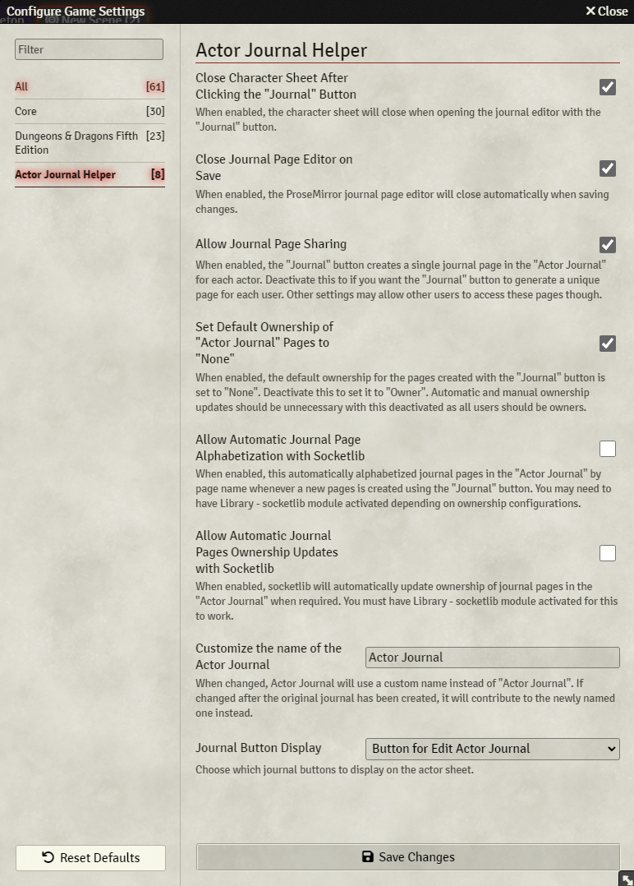
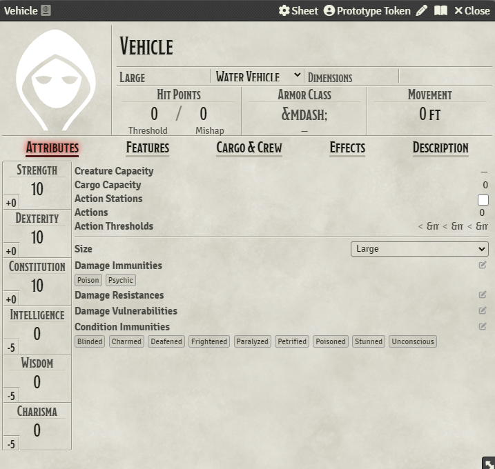
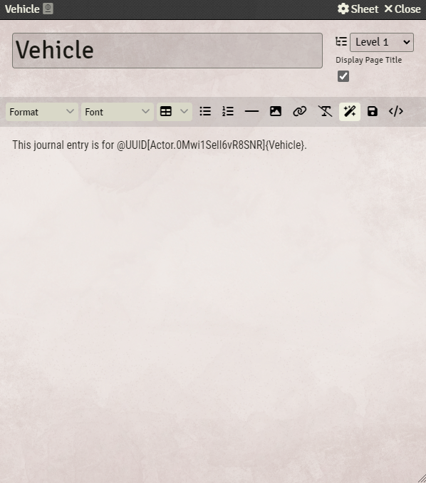
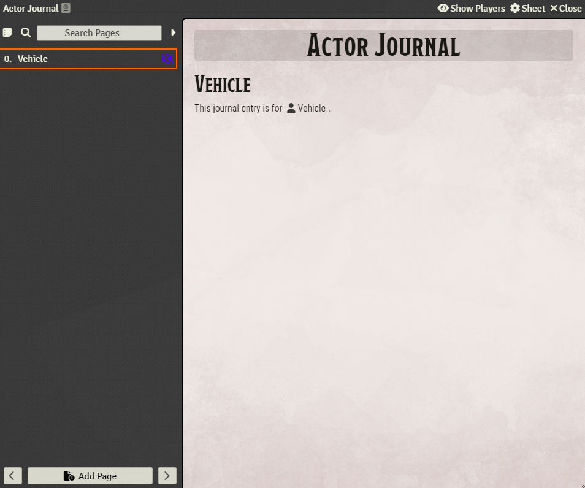

# Actor Journal Helper

**Foundry VTT Compatibility**: Version 13.x

## Manifest URL
https://raw.githubusercontent.com/puddleimages/actor-journal-helper/main/module.json

## Dependencies
While it is not a dependency for the module, installing and enabling **Socketlib** before enabling the optional 'Automatic Ownership Updates' setting is highly recommended.

I also recommend that you use **[Ownership Viewer](https://foundryvtt.com/packages/permission_viewer)** in conjunction with this module because of the convenience it adds to viewing and adjusting ownership levels.
 
## Description

The intent of this module is to make it easy for players to take notes about any actors they encounter by simplifying the creation of associated journal pages and providing convenient access via buttons on actor sheets.

For GMs, it offers options for the calculated removal of manual configuration burdens related to token and journal page ownership, thoughtfully streamlining setup and facilitating player note-taking throughout gameplay.

## Installation

1. In Foundry VTT, navigate to the "Add-On Modules" tab in the Configuration and Setup menu.
2. Click the "Install Module" button.
3. Paste the following URL into the "Manifest URL" field: `https://raw.githubusercontent.com/puddleimages/actor-journal-helper/main/module.json`
4. Click "Install" and wait for Foundry VTT to automatically install the module.

## Usage

1. Activate the module and, optionally, activate library - socketlib.
2. Configure the optional setting to your liking.
3. Open an actor's sheet (limited ownership or higher required).
4. Look for the journal button in the sheet's header.
5. Click the button to open an editor for an existing or newly created journal page associated with the actor.
6. Enjoy the simplified navigation to the editor of the associated journal page.
7. Enjoy the automatically generated link to the actor's sheet of an actor from their corresponding journal page.
7. Optionally, with automatic ownership updates, managing ownership of these journal pages is simplified.

**Usage Notes**

When using this module, it is recommended that the GM grants players "limited" ownership of actors as the players encounter those actors. This allows players to take advantage of the journal button and add content to the generated journal pages collaboratively (or independently if they are the only player with access to the page). Keep it in mind that pages which are manually added to the Actor Journal won't be linked to any actor because they won't be flagged appropriately unless they are created from the button actor's sheet. Also, an actor that is deleted and then recreated will not be associate with any previously created journal page.

Players can access an actor's sheet by clicking on them in the actor tab or double-clicking a token on the canvas if they have at least "limited" ownership of the associated actor.

## Features

- **Actor Journal Creation**: An Actor Journal is automatically created when the world is loaded.
- **Journal Page Generation**: One or two journal buttons are added to the header of actor sheets. When clicked, a journal page associated to that actor is rendered.
- **Actor Sheet Link**: When a journal button is clicked for the first time and an associated page is generated, a link to the actor sheet is added to the journal page.
- **Actor Image Rendering**: When a journal button is clicked for the first time and an associated page is generated, an image of the actor can optionally be added to the journal page.
- **Varied Ownership Automation**: A large portion of the module features are only accessible to players when they have at least "limited" ownership of an actor. The default ownership for each generated page is set to "none" for every player except the one that created the page via a journal button, unless access to the generated journal pages is restricted still via each the players's ownership status of the associated actor.
- **Optional Settings**: Optional settings are provided to allow flexibility and for accommodating some other potential preferences. However, it is recommended that you enable all optional setting for the best experience.

## Optional Features

- **Close Actor Sheet After Clicking a journal Button**: When enabled, the actor sheet will close when opening the journal via a journal button.
- **Close Journal Page Editor on Save**: When enabled, the ProseMirror journal page editor will close automatically when saving changes.
- **Allow Journal Page Sharing**: When enabled, the journal buttons create a single journal page in the Actor Journal for an actor. Deactivate this to if you want the journal buttons to generate a unique page for each user. Other settings may allow other users to access these pages though.
- **Set Default Ownership of Actor Journal Pages to "None"**: When enabled, the default ownership for the pages created with the journal buttons are set to "None". Deactivate this to set it to "Owner". Automatic and manual ownership updates should be unnecessary with this deactivated as all users should be owners.
- **Allow Automatic Journal Page Alphabetization with Socketlib**: When enabled, this automatically alphabetized journal pages in the Actor Journal by page name whenever a new pages is created using a journal button. You may need to have Library - socketlib module activated depending on ownership configurations.
- **Allow Automatic Journal Pages Ownership Updates with Socketlib**: When enabled, socketlib will automatically update ownership of journal pages in the Actor Journal when required. You must have Library - socketlib module activated for this to work.
- **Allow Automatic Actor Ownership Updates with Socketlib**: When enabled, socketlib will automatically update a player's ownership of an actor to limited when they double click on an associated token. You must have Library - socketlib module activated for this to work. Actors created via transformations when this module is enabled will have a flag pointing these ownership request to the source actor instead of the transformed or original actors.
- **Change Name of Default Actor Journal Page**: When the default value is changed, Actor Journal can use a custom name instead of "Actor Journal".
- **Journal Button Display Options**: Allows users to choose which journal buttons are displayed on the actor sheet; Edit Actor Journal, View Actor Journal, or both.

## Screenshots

## Feedback and Support

If you encounter any issues or have suggestions for improvements, please [open an issue](https://github.com/puddleimages/actor-journal-helper/issues) on GitHub.

---

**Author**: puddleimages

**GitHub Repository**: [Actor Journal Helper](https://github.com/puddleimages/actor-journal-helper)
